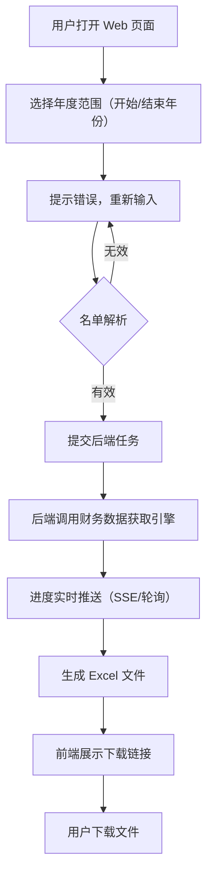

## 1. 产品概述

为"上市公司年报财务数据获取工具"提供一个 Web 操作界面，用户通过浏览器即可选择年度范围、输入企业名单或上传名单文件，提交后自动获取三大财务报表数据并以 Excel 格式输出。

- 核心问题：原 CLI 交互式/命令行模式对非技术用户不友好，缺乏直观的数据输入方式
- 目标用户：金融分析师、投资者、企业财务人员，无需掌握命令行操作
- 产品价值：降低使用门槛，提升操作效率，支持文件批量上传

## 2. 核心功能

### 2.1 功能模块

1. **年度范围选择**：双滑块或下拉选择开始/结束年份，带联动校验
2. **企业名单输入**：支持文本框手动输入（逗号/换行分隔）和文件上传（.txt/.csv）
3. **任务提交与结果反馈**：提交后显示进度，完成后提供 Excel 文件下载

### 2.2 页面详情

| 页面名称 | 模块名称 | 功能描述 |
|---------|---------|---------|
| 首页（单页） | 年度范围选择 | 提供开始年份和结束年份的下拉/输入选择器，默认当前年份往前5年 |
| 首页（单页） | 企业名单输入 | 文本框支持手动输入股票代码或公司名称（逗号/换行分隔）；文件上传支持 .txt 和 .csv |
| 首页（单页） | 操作按钮 | "开始获取数据"按钮提交任务；"清空"按钮重置表单 |
| 首页（单页） | 进度与结果 | 实时显示处理进度条和日志；完成后展示生成文件列表，支持下载 |

## 3. 核心流程

## 4. 用户界面设计

### 4.1 设计风格

- **主题**：深色科技金融风格（Dark Mode Premium），营造专业数据分析工具的质感
- **主色**：`#0A1628`（深邃蓝黑背景）、`#1A2A44`（卡片底色）
- **强调色**：`#4FC3F7`（电光蓝）、`#00E5FF`（青蓝高亮）、`#FF6B6B`（警示红）
- **文字色**：`#E8EDF2`（主文字）、`#8E9BAE`（辅助文字）
- **字体**：标题用 `Orbitron`（科技感），正文用 `'Noto Sans SC'`（中文优化）
- **按钮**：扁平化，悬停时发光边框效果
- **布局**：居中单页卡片式，最大宽度 680px，大量留白

### 4.2 页面设计概览

| 页名称 | 模块名称 | UI 元素 |
|-------|---------|---------|
| 主页 | 年度范围选择 | 两个下拉选择器并排，选中年份高亮青色边框，含渐变背景动画 |
| 主页 | 企业名单输入 | 半透明输入框，placeholder 为示例文本；文件上传区域为虚线边框拖拽区 |
| 主页 | 操作按钮 | 主按钮（电光蓝渐变+发光阴影）、次按钮（透明边框） |
| 主页 | 进度与结果 | 动态进度条（青色填充），日志滚动区域，下载按钮带文件图标 |

### 4.3 响应式设计

- 桌面优先，移动端自适应（卡片宽度自动收缩）
- 触摸设备优化：按钮最小 44px 触控区域