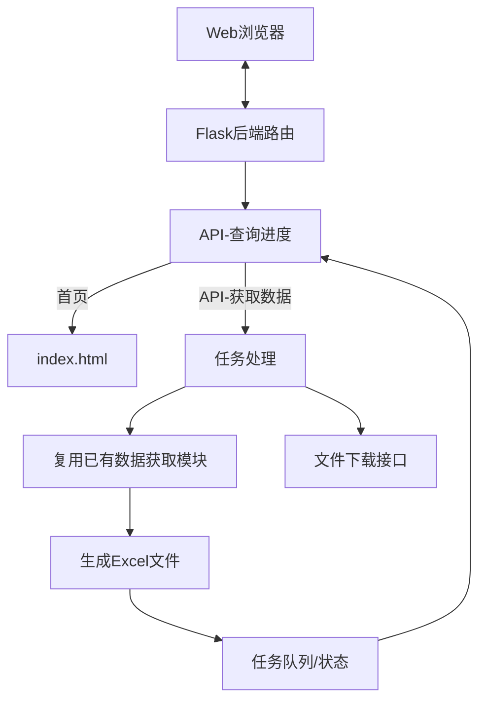

# 技术架构文档

## 1. 技术选型

| 层级 | 技术选型 | 理由 |
|-----|---------|------|
| 后端 | Python Flask | 轻量开箱即用，适配已有 Python 代码，可直接复用原有抓取逻辑 |
| 前端 | 原生 HTML + CSS + JS | 页面简单，无需引入框架，减少依赖，直接交付 |
| 通信 | 同步HTTP请求 + 进度轮询 | 实现简单，兼容所有环境，无需复杂服务端推送 |
| 文件存储 | 本地文件系统 | 运行在本机，下载直接返回，无需对象存储 |
| 并发 | 单线程任务排队 | 单次请求通常处理几个公司，无需复杂线程池 |

## 2. 系统架构



## 3. 模块划分

| 模块名 | 职责 | 接口设计 |
|-------|------|---------|
| Flask App | HTTP服务路由、静态文件 | `GET /` 返回主页；`POST /api/fetch` 提交任务；`GET /api/progress` 查询进度；`GET /download/<filename>` 下载文件 |
| Task Manager | 任务管理、状态追踪、结果存储 | 内存维护 `tasks` 字典，每个任务ID记录状态、进度、文件路径 |
| Worker | 调用已有 `main.py` 逻辑，异步执行 | 接收任务参数 → 调用 `FinancialDataFetcher` → 实时更新进度 → 存储结果文件 |
| 原有模块 | 复用：`cninfo_api.py` / `cninfo_fin_data.py` / `excel_writer.py` / `config.py` | 直接导入调用，无需修改原有逻辑 |

## 4. 数据模型

### 4.1 任务状态对象

```python
{
    "id": "uuid",
    "start_year": int,
    "end_year": int,
    "companies": list,  # [(code, name), ...]
    "status": "pending" | "processing" | "done" | "error",
    "progress": {
        "current": 0,
        "total": 0,
        "message": str
    },
    "files": [  # 生成的文件列表
        {
            "name": str,
            "path": str,
            "size": int
        }
    ],
    "created_at": float,
    "error": str or null
}
```

## 5. 安全性 & 错误处理

1. **输入校验**：年份范围校验（1990 ~ 当前年份），企业名称/代码长度限制，文件名消毒防路径遍历
2. **文件存储**：生成文件名使用公司名称+时间戳消毒后存储，文件放在 `output` 目录，不允许路径遍历
3. **并发控制**：同一IP同时只处理一个任务，避免过载
4. **错误反馈**：API返回清晰错误信息，前端展示给用户

## 6. 目录结构

```
/workspace/
├── config.py              # 原有配置
├── cninfo_api.py          # 原有API封装
├── cninfo_fin_data.py     # 原有数据获取
├── excel_writer.py        # 原有Excel写入
├── main.py                # 原有CLI入口（保留）
├── app.py                 # 新增：Flask web服务
├── requirements.txt       # 新增依赖
├── templates/
│   └── index.html         # 新增：前端页面
├── static/
│   ├── css/
│   │   └── style.css      # 新增：样式
│   └── js/
│       └── script.js      # 新增：交互逻辑
└── output/                # 输出目录（运行自动创建）
```

## 7. 关键设计决策

1. **复用已有代码**：直接 import 调用原有模块，不做侵入式修改，保持兼容性
2. **任务轮询**：不使用复杂 WebSocket 或 SSE，前端简单轮询进度，实现简单可靠
3. **原生前端**：避免引入打包工具（webpack/vite），修改直接刷新就能用，部署方便
4. **单服务器**：前后端同域，无需CORS配置，直接运行即可访问
